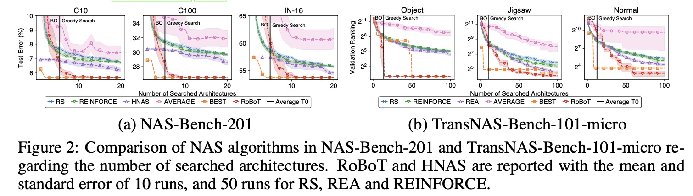
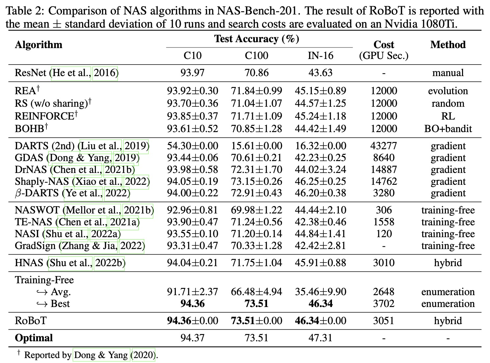
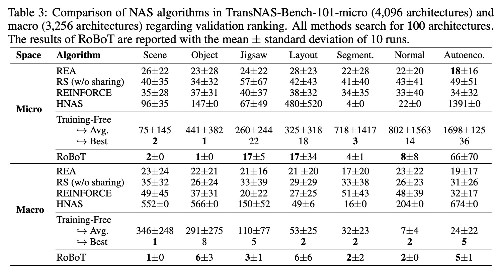
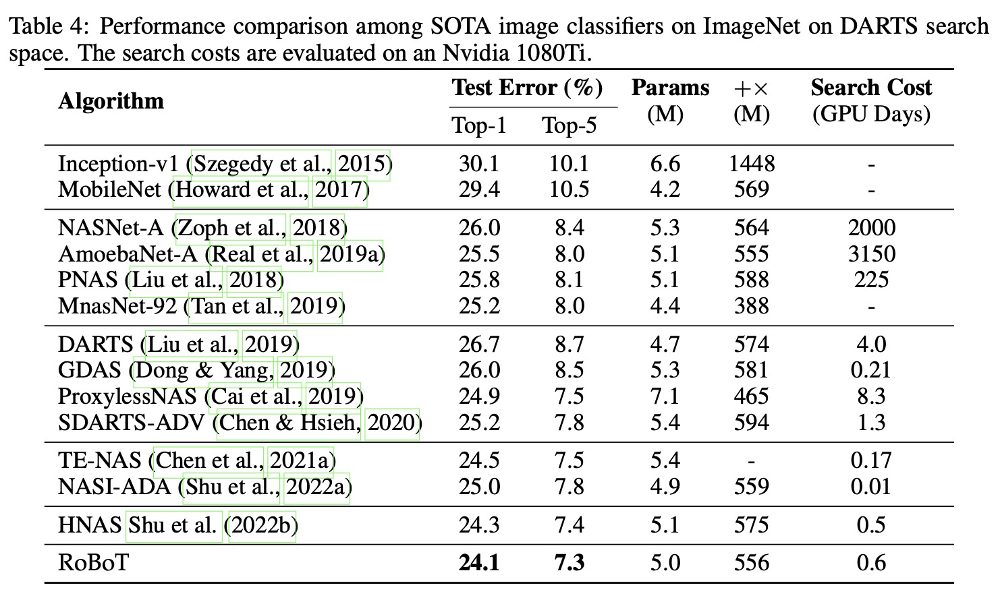

# [ICLR 2024] Robustifying and Boosting Training-Free Neural Architecture Search (RoBoT)
This repository is the official implementation of [Robustifying and Boosting Training-Free Neural Architecture Search](https://openreview.net/pdf?id=qPloNoDJZn).
The DARTS space implementation is based on [Unifying and Boosting Gradient-Based Training-Free Neural Architecture Search](https://github.com/shuyao95/HNAS).


## Requirements

- [tensorboardX](https://pypi.org/project/tensorboardX/)
- [Pytorch v1.6 or later](https://pytorch.org)
- [Bayesian Optimization package](https://github.com/fmfn/BayesianOptimization)

For setup, it is recommended to create a new conda environment.

```bash
conda create -n robot python=3.8
conda activate robot
pip install -r requirements.txt
```

## Preparing Training-Free Metrics
### For NAS-Bench-201
We directly utilize the training-free metrics computed by [Zero-Cost-NAS](https://github.com/SamsungLabs/zero-cost-nas). To reproduce, please refer to their code.
Please download the computed results from their provided [Google Drive](https://drive.google.com/drive/folders/1mSKVpH5vqTB1shrKnraKDJy_983dEyQJ), 
and put them into the `data` folder:
```
data/
    nb2_cf10_seed42_dlrandom_dlinfo1_initwnone_initbnone.p
    nb2_cf100_seed42_dlrandom_dlinfo1_initwnone_initbnone.p
    nb2_im120_seed42_dlrandom_dlinfo1_initwnone_initbnone.p
```
These files already contain the validation accuracy of each architecture which can be used as the objective evaluation metric observation for BO.

In practice, to save querying time cost, we query for the validation accuracy on CIFAR-10 when trained for 12 epochs (i.e., "hp=12") from the tabular data in NAS-Bench-201, 
and record the corresponding costs.
We collect above information in `data/nb2_cf10_hp12_info.p`. For the test accuracy, we collect them in `data/nb2_cf10_test_accuracy.p`, 
`data/nb2_cf100_test_accuracy.p` and `data/nb2_im120_test_accuracy.p`. All the information is collected from [NAS-Bench-201 API](https://github.com/D-X-Y/NAS-Bench-201).
### For TransNAS-Bench-101
We directly utilize the training-free metrics computed by [NASLib](https://github.com/automl/NASLib/tree/zerocost). To reproduce, please refer to their code.
Please download the computed results from their provided Google Drive for [TransNAS-Bench-101-micro](https://drive.google.com/file/d/1SBOVAyhLCBTAJiU_fo7hLRknNrGNqFk7/view) and
[TransNAS-Bench-101-macro](https://drive.google.com/file/d/1teH8JcQsamZngUD_DMQyNkCoUYYSTM0M/view), and put them into the `data` folder:
```
data/
    zc_transbench101_macro.json
    zc_transbench101_micro.json
```
### For DARTS Search Space
We manually compute the training-free metrics value. While CIFAR-10 can be automatically downloaded by torchvision, 
ImageNet needs to be manually downloaded (preferably to a SSD) following the instructions [here](https://github.com/pytorch/examples/tree/main/imagenet).
Please refer to [DARTS](https://github.com/quark0/darts) project for more details.

## Searching for the Optimal Architecture
### For NAS-Bench-201
Below are examples of usage. Please refer to `parse_arguments()` for other possible arguments.
```bash
python search_nb201.py C10 
python search_nb201.py C100
python search_nb201.py IN-16
```
### For TransNAS-Bench-101
Below are examples of usage. Please refer to `parse_arguments()` for other possible arguments.
```bash
python search_tnb101.py micro class_scene
python search_tnb201.py macro class_scene
python search_tnb201.py micro normal
```
### For DARTS Search Space
(GPU required) To compute training-free metrics and run RoBoT to find the proposed architecture, please run
```bash
python darts_space/search.py --dataset cifar10 # search on cifar10
python darts_space/search.py --dataset cifar100 # search on cifar10 
python darts_space/search.py --dataset imagenet --data /path/to/imagenet/dataset/ --epochs 3 --total_iters 10 --n_sample 60000 --seed 0 --drop_path_prob 0.0 --learning_rate 1 --train_portion 0.25 --batch_size 800 # search on imagenet
```
The Genotype of the obtained architecture with the optimal validation performance will be printed at last. Please 
update this Genotype in `darts_space/genotypes.py`. Our obtained architecture has already listed in the file. To fully train and test the performance, please run
```bash
# Train on CIFAR-10
python darts_space/train_cifar.py --auxiliary --cutout --arch CIFAR_10_arch --save log_name --data path/to/cifar10/data/ --dataset cifar10 --learning_rate 0.025 --auxiliary_weight 0.4 --drop_path_prob 0.2 
# Train on CIFAR-100
python darts_space/train_cifar.py --auxiliary --cutout --arch CIFAR_100_arch --save log_name --data path/to/cifar100/data/ --dataset cifar100 --learning_rate 0.035 --learning_rate_min 0.0001 --auxiliary_weight 0.6 --drop_path_prob 0.3
# Train on ImageNet
CUDA_VISIBLE_DEVICES=0,1,2,3,4,5,6,7 python -m torch.distributed.launch --nproc_per_node=8 --master_port 30408 train_imagenet.py --arch ImageNet_arch --save log_name --auxiliary --data_dir path/to/imagenet/data/
```
You may replace the `--arch` configure with your own architecture.

## Results
We list the main results below. For more details, please refer to our paper.






## Bibtex
If you find this code useful, please consider citing our paper
```
@inproceedings{he2024robustifying,
  title={Robustifying and Boosting Training-Free Neural Architecture Search},
  author={He, Zhenfeng and Shu, Yao and Dai, Zhongxiang and Low, Bryan Kian Hsiang},
  booktitle={The Twelfth International Conference on Learning Representations},
  year={2024}
}

```